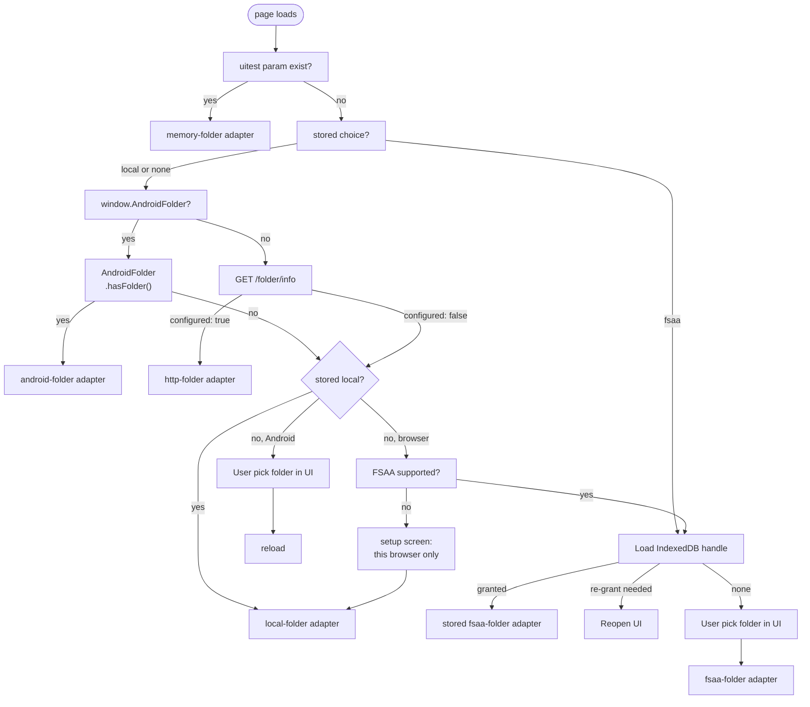

# Architecture

The prototype settled the transport and the platform constraints — see
[§2 What the prototype settled](#2-what-the-prototype-settled). It settled nothing about the application itself, which
is what the rest of this document works through. [§1 Scope and status](#1-scope-and-status) indexes what is decided and
what is not.

The sync process and what a device actually writes into the folder in [sync-flow.md](sync-flow.md).

---

## 1. Scope and status

| Area | State | Where |
| --- | --- | --- |
| Folder-based transport between Windows and Android | Proven | [§2 What the prototype settled](#2-what-the-prototype-settled) |
| Browser reach to a local folder, per browser | Proven | [§4 The folder adapter](#4-the-folder-adapter) |
| Convergence of a single text field | Proven | [sync-flow.md §2 What the prototype settled](sync-flow.md#2-what-the-prototype-settled) |
| Convergence of a tree | Decided | [sync-flow.md §4.6 The decision](sync-flow.md#46-the-decision) |
| Internal shape of the app | Decided | [past_decision.md §3 State Management](past_decision.md#3-state-management) |
| Technology stack | Decided | [§6 Technology stack](#6-technology-stack) |
| Packaging per platform | Decided | [§7 Packaging](#7-packaging) |

The prototype does not share code with the production tree, and now lives in a project of its own. It was a stepping
stone for the design — the adapter contract, the one-writer-per-file rule, the version vector — and the design is all
that crossed over. Every file it proved was rewritten under `src/`.

## 2. What the prototype settled

Five results for the production design has to keep, because they are properties of the environment:

**A synced folder is the whole transport.** Three operations — `list`, `read`, `write` — are all a cloud provider has to
grant, and it grants them by being a folder. No API, no OAuth, no account, no server. The provider's desktop or phone
client is the only thing on the network.

**One writer per file removes every race at the file layer.** A device writes only paths carrying its own device id, so
two devices never write one path and the provider's conflict-copy behaviour never fires. Races move up into the
application content, where a version vector detects them.

**The folder never announces anything.** No provider client offers a change event a web page can subscribe to, so the
app polls — every 3 s and on window focus in the prototype. Any production design inherits the poll.

**A half-synced file is normal.** The provider client can be mid-download when `read` lands on a file. The prototype
skips a file that fails to parse and picks it up whole on the next cycle, and writes through a temp file plus atomic
rename so it never publishes a partial file itself.

**Firefox cannot hold a folder handle.** Mozilla declined the File System Access API, so on Firefox the page reaches the
folder only through a loopback helper on this device. On Android the folder arrives through a WebView bridge over the
Storage Access Framework. This is the constraint that shapes packaging.

## 3. The layer model

```
UI            the page
              (Windows browser, Android WebView)
                    │
                    ▼
Logic layer   tree, edits, merge
              sync cycle
              folder adapter interface
                    │
                    ▼
Storage       Local Folder ──▶ provider's client ──▶ Sync Folder
```

The logic layer has no I/O, no clock and no `window`. Time enters as a `now()` parameter, the folder enters as an
adapter object, and the UI enters as an `onChange` callback. `src/app/folder-sync.ts` takes all three the same way,
which is why a headless test and the browser run the same code.

## 4. The folder adapter

An adapter is three methods and nothing else:

```
list()               -> Promise<string[]>
read(name)           -> Promise<string | null>
write(name, content) -> Promise<void>
```

Every storage that can hold a folder can offer them. The prototype ships five:

| Adapter | Runs in | Reaches the folder by |
| --- | --- | --- |
| `node-folder` | Node | `fs`, a real directory; write-then-rename |
| `fsaa-folder` | Chrome, Edge desktop | File System Access handle, kept in IndexedDB across restarts |
| `http-folder` | any desktop browser, needed for Firefox | `fetch` to this device's own helper on `127.0.0.1:38531` |
| `android-folder` | Android WebView | Storage Access Framework grant, over the Java bridge |
| `memory-folder` | anywhere | a fake for UI tests, no disk |
| `local-folder` | any browser | `localStorage`, one key per file name |

`local-folder` is the sixth, and it exists because M1 had one device and no Sync Folder while the payload was already
decided. It keeps the op log the only persistence and the three methods the only route to it, so M2 replaced an adapter
rather than a write path — requirement S-21. It is not a sync adapter: `localStorage` is per-origin and nothing mirrors
it anywhere, which is why the app names it "This browser only" and says so where it shows the folder.

The production app needs the prototype's five for the same reasons. M1 shipped `memory-folder` and `local-folder`; M2
added `fsaa-folder`, `http-folder` and `android-folder`, which is every browser-side one. `node-folder` has no caller in
the app — nothing production runs in Node — so it stays the prototype's. Keeping the interface at three methods is what
lets the merge logic be tested against a plain object and shipped against a phone.

**Adapter selection at startup.** On every page load, "How can this browser reach a local folder?" is asked.
`src/app/folder-choice.ts` is that question, and the flowchart below is its shape.



Four things the flowchart is worth reading twice for.

**A stored `fsaa` is first, and it is only ever what the user picked.** A device that picked a folder does not silently
move to a different way of reaching one because the browser changed overnight, and a helper serving the same origin does
not take it over. It lives in `localStorage`, per-origin like the device id.

**A stored `local` is not a folder, so the shells outrank it — X-18.** `local` records that this device had no folder to
reach when it was set up; it is not a preference for having none. A device whose own launcher is now holding a folder
takes it, on the next load, without being asked. That is a deliberate exception to the rule above and it is narrow: only
the two shells that hand a folder in *unasked* can override `local`, and they can override nothing else.

The exception is there because without it the fallback has no exit on the browser it matters on. Firefox is the browser
the loopback helper exists for, and it has no picker to offer instead — so a device that answered "this browser only"
once, on a launch with no `--folder` or before setup had run, kept that answer forever while the folder sat in the
process that was serving the page. The way in is easy to fall through and there was no way back out; row 11 of
[requirements.md §15 Deviations and defects found during verification](requirements.md#15-deviations-and-defects-found-during-verification)
is that bug.

**The key is left alone when the shell's folder is taken.** Nothing is written on adoption, so a device that later runs
without its helper reads `local` again and returns to the browser-only fallback rather than to a setup screen. The rows
it wrote there are still in `localStorage`, untouched, and it sees them again.

**A folder that already holds this device's op log counts as a stored choice of `local`.** Without that rule, every
device that ran M1 would come back to a setup screen with its tree apparently gone — the ops are in `localStorage`, the
setup screen is not looking there, and "where did my checklist go" is not a question to answer with a migration note.

**The unsupported branch ends in an adapter rather than an apology.** A browser that can reach no folder can still run
the whole application against `local-folder`; what it cannot do is sync. The setup screen says exactly that, and the
shell keeps saying it in the sidebar's footer, because a user who believes they are synced and is not is the one failure
this design must never produce silently. It is the only thing that footer says besides the Settings entry: a device that
*is* synced has nothing to warn about, so the line is absent rather than reassuring.

### 4.1 Shell actions, beside the adapter

The adapter answers "what is in the folder". It does not answer "show me the folder", and it must not learn to: three
methods is what lets the merge be tested against a plain object and shipped against a phone, and a fourth method exists
for one adapter and is a stub in the other five —
[code-standard.md §3 Module boundaries](code-standard.md#3-module-boundaries).

So X-15 to X-17 are a separate, entirely optional capability. `src/app/shell.ts` asks the shell that is actually running
— the Android bridge, the loopback helper, the browser — what it can do, and the settings screen renders only the
answers it gets:

| Action | Android | Windows helper | Browser |
| --- | --- | --- | --- |
| `openFolder` | `AndroidFolder.openFolder()`, an `ACTION_VIEW` on the granted tree | `POST /shell/open` with `{"what":"folder"}` | — |
| `openApp` | `AndroidFolder.openApp(pkg)`, the launch intent for a package | `POST /shell/open` with `{"what":"app"}` and a command found on `PATH` | — |
| `changeFolder` | `AndroidFolder.pickFolder()` | — (`--folder` is the launcher's) | The File System Access picker |

Three properties keep this from being the fourth method by another name:

**Nothing in the sync path calls any of it.** A device with no shell actions at all syncs identically. They are
convenience, and the merge cannot tell whether they exist.

**None of it is how a device gets *onto* a folder.** X-18 was drafted as a fourth action here — "the folder this shell
is holding, offered to a device on the fallback" — and that was the wrong place for it. Startup already asks the shells
that exact question, so the answer belongs where the folder is chosen and not on a screen the user has to find first. It
also has to be asynchronous, where every other answer on this table is a property of `globalThis`. `shellActions` stays
synchronous and this table stays three rows because the fix went into §4's flowchart instead.

**The helper takes a command, never a path.** `POST /shell/open` accepts a bare command name matching the same narrow
pattern the folder API uses, resolves it with `shutil.which` and runs it with no arguments and no shell. It cannot be
asked to run something out of a directory the caller names, which is the property that makes a loopback endpoint that
starts processes acceptable at all. It refuses cross-origin exactly as `/folder/` does.

**The folder itself is the one path the helper will open**, because the helper already had it: it came from `--folder`
on the command line rather than from the page.

## 5. Device identity and local storage

A device is identified by a generated id, never by a name the user typed. The id names the file, and one file per
device. The label travels inside the file.

| What | Where | Holds |
| --- | --- | --- |
| Sync Folder | provider's storage | the shared state; every device holds a full replica |
| Local Folder | device disk | the replica this device reads and writes |
| IndexedDB | browser | the folder handle, so startup does not re-prompt |
| `localStorage` | browser | device id and label, which folder this device chose, collapse state, dismissed conflict rows, the chosen theme |

No a local database sits between the UI and the Local Folder. The device id is per-origin, which
[§7.1 The two Windows bundles](#71-the-two-windows-bundles) turns into a live concern.

## 6. Technology stack

**Vite + TypeScript + Svelte, in a browser.**

| Layer | Choice |
| --- | --- |
| Language | TypeScript, `strict`, no `any` in the merge logic |
| View | Svelte components; a Svelte store is the Materialised State Store chosen in [past_decision.md §3 State Management](past_decision.md#3-state-management) |
| Build | Vite, producing a static bundle |
| Runs in | A desktop browser and an Android WebView |

The logic layer stays framework-free. Svelte reaches the view layer and nothing below it.

Constraints from `docs/requirements.md`: hash routing so it deploys to any static host with no rewrite rules (X-7), full
cold-start offline with everything precached (X-5), installable to a phone home screen and a desktop taskbar (X-3), and
a maskable Android icon (X-4).

## 7. Packaging

The UI is a web page, so "who hands that page a folder" gets a different answer per target. A shell is needed to hand
the page a folder when the browser can't reach one by themself.

| Target | Reaches the folder by | Ships as | Shell | Built by |
| --- | --- | --- | --- | --- |
| Windows, Chrome or Edge | File System Access handle, kept in IndexedDB | a URL on any static host, installed as a PWA | x | `make build` |
| Windows, Firefox | the loopback helper on `127.0.0.1:38531` | a zip: web assets, embeddable Python, a shortcut | a stdlib-only Python helper | `make windows` |
| Android | a Storage Access Framework grant over a Java bridge | an APK | a WebView activity, four Java files | `make apk` |

Both shells live under `packaging/`, and neither is part of the web build: `packaging/windows/` is the helper and the
zip's loose files, `packaging/android/` is the Gradle project and its Dockerfile. Both take `dist/` as input, so `make
windows` and `make apk` build the web bundle first and copy it in — the phone and the laptop cannot drift from each
other, because there is one build and it is copied rather than rebuilt.

Chrome and Edge can hold a File System Access handle across restarts. Firefox cannot. No browser on Android can pick a
folder. The phone needs a wrapper app holding a Storage Access Framework grant.

| Notes | What it removes |
| --- | --- |
| Firefox is nice to have, not the only browser | The helper stops being mandatory, so the Windows shell stops being mandatory with it. Chromium's handle covers the default path unaided. |
| Sync runs only while the app is open; no background sync is required | No shell can earn its place by promising background work. |
| A lapsed grant after a device reset or a reinstall is acceptable | Re-picking the folder is a rare click rather than a failure mode to design around. |
| The build may run on a Windows host as well as in Docker | Removes the obstacle to Tauri 2 without supplying a reason to want it. |


### 7.1 The two Windows bundles

Same web build, two distributions, differing only in what is wrapped around it:

- **Chromium.** No download. The build is published to a static host and installed from the browser. The service worker
  precaches on first visit, after which it cold-starts offline.
- **Firefox.** An official embeddable Python staged on the Windows side plus a shortcut to Microsoft's own signed
  `pythonw.exe`. No `.exe` is produced deliberately, SmartScreen never fires, and it needs no installer, no pip and no
  admin rights. It needs no static host and no network at all.

`make windows` produces `bundles/checklist-windows.zip`: `web/` (the `dist/` build), `serve.py`, `Setup.vbs`,
`Checklist.bat`, `Checklist.ico` and a `README.txt`. The embeddable Python runtime is fetched once into `.build-cache/`
and staged into the zip under `python/`; `make windows PYTHON_EMBED=skip` omits it, for a machine that already has
Python and only wants the assets.

Two rules the zip is built to, and they are what make it a zip rather than an installer:

**Nothing reaches outside the folder it was unzipped into.** Every path the bundle names — the runtime, the helper, the
icon, the shortcut's target and working directory — is resolved from the folder holding `Setup.vbs` at the moment it
runs. No build machine's paths are baked in, so the zip is the same zip on any Windows box, and nothing in it refers to
the tree it was built from. In particular the build may run under WSL and the bundle may not know that: a shortcut
reaching back over `\\wsl.localhost` would be a bundle that only works on the machine that built it.

**No console window, ever, on the normal path.** Unzip anywhere and double-click `Setup.vbs`. It asks for the synced
folder with the system folder dialog, writes the answer to `folder.txt` beside itself, puts `Checklist.lnk` on the
desktop and in the folder, and starts the app. The shortcut targets `python\pythonw.exe` — Microsoft's own signed
binary, and the one with no console — passing `serve.py` and the folder as arguments. Later launches are the desktop
icon and nothing else. `Setup.vbs` runs under `wscript.exe`, which is why it is not a `.ps1`: a script double-clicked by
someone who never opens a terminal must not meet ExecutionPolicy first.

`Checklist.bat` is the exception and the reason it stays: it runs the same helper under `python.exe` in a visible
console, so a launch that fails silently under `pythonw.exe` can be made to say why. It is the diagnostic, not the way
in. Changing folders later is `folder.txt` — edit it, or delete it and run `Setup.vbs` again.

The helper serves `web/` and exposes `/folder/info`, `/folder/list` and `/folder/file/<name>` — exactly the three
methods `src/adapters/http-folder.ts` calls, and nothing more. It is stdlib-only, which is what lets an embeddable
Python run it with no pip.

Two costs come with running both:

**A device identity per origin.** The helper serves from `127.0.0.1:38531`; the static host serves from its own origin.
`localStorage` is per-origin, so the device id too. One machine used through both bundles is two devices, writing two
files. The identity model has to tolerate that, or offer to adopt an existing id when a second origin starts up.

Firefox on the desktop does not install PWAs, so the bundle's shortcut is what puts the app on the taskbar there.
Chromium installs it properly.

### 7.2 Android — the WebView shell

Already written and tested in the prototype, four Java files and no framework:

- `MainActivity.java` serves the bundled web assets through a `WebViewAssetLoader`, so the page is local rather than
  fetched, and exposes `FolderBridge` to it as `window.AndroidFolder`.
- First run has no folder, so it fires `ACTION_OPEN_DOCUMENT_TREE` — the system folder picker, and the only prompt.
- `FolderStore.java` calls `takePersistableUriPermission` on the granted tree and keeps the URI in `SharedPreferences`.
  A plain SAF grant dies with the process; the persistable one survives reboots, which is why later launches go straight
  to the folder.
- The `android-folder` adapter wraps the bridge in the same three methods every other adapter offers.

Built inside Docker, with the web assets copied in at build time so the phone cannot drift from the laptop. Nothing is
installed on the host: `make apk` builds the image, runs one `gradle assembleDebug` in it as the invoking user, and
copies the result to `bundles/checklist.apk`. `make apk-clean` drops the Gradle cache and the build output.

Docker is the one host dependency, and it is checked for by name rather than reached as a missing binary — a build that
fails with `docker: not found` after ten minutes of Gradle is worse than one that refuses in a second.

### 7.3 Accepted limits

Consequences of the decision, accepted rather than mitigated:

| Limit | Why it stands |
| --- | --- |
| No background sync on the phone | A WebView shell has no service of its own, so the phone syncs while the app is open. True of Capacitor and Tauri equally; only a real native background service changes it, and that is a different application rather than a different package. |
| A re-grant click on Windows | Chrome persists the handle but may ask again on restart — the `re-grant needed` branch in [§4 The folder adapter](#4-the-folder-adapter). One click, sometimes, at launch. |
| A lapsed Android grant after a reset or reinstall | The folder is picked again. The stored URI is the only thing lost; the folder's contents are the state. |