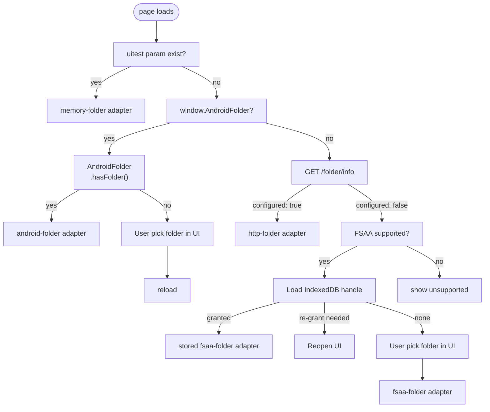

# Architecture

The prototype settled the transport and the platform constraints — see
[§2 What the prototype settled](#2-what-the-prototype-settled). It settled nothing about the application itself, which
is what the rest of this document works through. [§1 Scope and status](#1-scope-and-status) indexes what is decided and
what is not.

The sync process and what a device actually writes into the folder in [sync-flow.md](sync-flow.md).

---

## 1. Scope and status

| Area | State | Where |
| --- | --- | --- |
| Folder-based transport between Windows and Android | Proven | `prototype/core/`, `prototype/adapters/` |
| Browser reach to a local folder, per browser | Proven | [§4 The folder adapter](#4-the-folder-adapter) |
| Convergence of a single text field | Proven | [sync-flow.md §2 What the prototype settled](sync-flow.md#2-what-the-prototype-settled) |
| Convergence of a tree | Decided  | [sync-flow.md §4.6 The decision](sync-flow.md#46-the-decision) |
| Internal shape of the app | Decided | [past_decision.md §3 Application shape](past_decision.md#3-application-shape) |
| Technology stack | Decided | [§6 Technology stack](#6-technology-stack) |
| Packaging per platform | Decided | [§7 Packaging](#7-packaging) |

The prototype does not share code with the production tree. The prototype is a stepping stone for the design: the
adapter contract, the one-writer-per-file rule, the version vector and, where it survives review, the source of
`core/merge.mjs`.

## 2. What the prototype settled

Five results for the production design has to keep, because they are properties of the environment:

**A synced folder is the whole transport.** Three operations — `list`, `read`, `write` — are all a cloud provider has to
grant, and it grants them by being a folder. No API, no OAuth, no account, no server. The provider's desktop or phone
client is the only thing on the network.

**One writer per file removes every race at the file layer.** A device writes only paths carrying its own device id, so
two devices never write one path and the provider's conflict-copy behaviour never fires. Races move up into the
application content, where a version vector detects them.

**The folder never announces anything.** No provider client offers a change event a web page can subscribe to, so the
app polls — every 3 s and on window focus in the prototype. Any production design inherits the poll.

**A half-synced file is normal.** The provider client can be mid-download when `read` lands on a file. The prototype
skips a file that fails to parse and picks it up whole on the next cycle, and writes through a temp file plus atomic
rename so it never publishes a partial file itself (`prototype/adapters/node-folder.mjs`).

**Firefox cannot hold a folder handle.** Mozilla declined the File System Access API, so on Firefox the page reaches the
folder only through a loopback helper on this device. On Android the folder arrives through a WebView bridge over the
Storage Access Framework. This is the constraint that shapes packaging.

## 3. The layer model

```
UI            the page
              (Windows browser, Android WebView)
                    │
                    ▼
Logic layer   tree, edits, merge
              sync cycle
              folder adapter interface
                    │
                    ▼
Storage       Local Folder ──▶ provider's client ──▶ Sync Folder
```

The logic layer has no I/O, no clock and no `window`. Time enters as a `now()` parameter, the folder enters as an
adapter object, and the UI enters as an `onChange` callback. `prototype/core/folder-sync.mjs` takes all three as
constructor arguments, which is why the headless scenario test and the browser run the same code.

## 4. The folder adapter

An adapter is three methods and nothing else:

```
list()               -> Promise<string[]>
read(name)           -> Promise<string | null>
write(name, content) -> Promise<void>
```

Every storage that can hold a folder can offer them. The prototype ships five:

| Adapter | Runs in | Reaches the folder by |
| --- | --- | --- |
| `node-folder` | Node | `fs`, a real directory; write-then-rename |
| `fsaa-folder` | Chrome, Edge desktop | File System Access handle, kept in IndexedDB across restarts |
| `http-folder` | any desktop browser, needed for Firefox | `fetch` to this device's own helper on `127.0.0.1:38531` |
| `android-folder` | Android WebView | Storage Access Framework grant, over the Java bridge |
| `memory-folder` | anywhere | a fake for UI tests, no disk |

The production app needs the same five for the same reasons. Keeping the interface at three methods is what lets the
merge logic be tested against a plain object and shipped against a phone.

**Adapter selection at startup.** On every page load, "How can this browser reach a local folder?" is asked.



## 5. Device identity and local storage

A device is identified by a generated id, never by a name the user typed. The id names the file, and one file per
device. The label travels inside the file.

| What | Where | Holds |
| --- | --- | --- |
| Sync Folder | provider's storage | the shared state; every device holds a full replica |
| Local Folder | device disk | the replica this device reads and writes |
| IndexedDB | browser | the folder handle, so startup does not re-prompt |
| `localStorage` | browser | device id and label |

No a local database sits between the UI and the Local Folder. The device id is per-origin, which
[§7.1 The two Windows bundles](#71-the-two-windows-bundles) turns into a live concern.

## 6. Technology stack

**Vite + TypeScript + Svelte, in a browser.**

| Layer | Choice |
| --- | --- |
| Language | TypeScript, `strict`, no `any` in the merge logic |
| View | Svelte components; a Svelte store is the observable store chosen in [past_decision.md §3 Application shape](past_decision.md#3-application-shape) |
| Build | Vite, producing a static bundle |
| Runs in | A desktop browser and an Android WebView |

The logic layer stays framework-free. Svelte reaches the view layer and nothing below it.

Constraints from `docs/requirements.md`: hash routing so it deploys to any static host with no rewrite rules (X-7), full
cold-start offline with everything precached (X-5), installable to a phone home screen and a desktop taskbar (X-3), and
a maskable Android icon (X-4).

## 7. Packaging

The UI is a web page, so "who hands that page a folder" gets a different answer per target. A shell is needed to hand
the page a folder when the browser can't reach one by themself.

| Target | Reaches the folder by | Ships as | Shell |
| --- | --- | --- | --- |
| Windows, Chrome or Edge | File System Access handle, kept in IndexedDB | a URL on any static host, installed as a PWA | x |
| Windows, Firefox | the loopback helper on `127.0.0.1:38531` | a zip: web assets, embeddable Python, a shortcut | prototype/install/serve.py |
| Android | a Storage Access Framework grant over a Java bridge | an APK | `prototype/android/app/src/main/java/dev/checklist/proto/*.java` |

Chrome and Edge can hold a File System Access handle across restarts. Firefox cannot. No browser on Android can pick a
folder. The phone needs a wrapper app holding a Storage Access Framework grant.

| Notes | What it removes |
| --- | --- |
| Firefox is nice to have, not the only browser | The helper stops being mandatory, so the Windows shell stops being mandatory with it. Chromium's handle covers the default path unaided. |
| Sync runs only while the app is open; no background sync is required | No shell can earn its place by promising background work. |
| A lapsed grant after a device reset or a reinstall is acceptable | Re-picking the folder is a rare click rather than a failure mode to design around. |
| The build may run on a Windows host as well as in Docker | Removes the obstacle to Tauri 2 without supplying a reason to want it. |


### 7.1 The two Windows bundles

Same web build, two distributions, differing only in what is wrapped around it:

- **Chromium.** No download. The build is published to a static host and installed from the browser. The service worker
  precaches on first visit, after which it cold-starts offline.
- **Firefox.** An official embeddable Python staged on the Windows side plus a shortcut to Microsoft's own signed
  `pythonw.exe`. No `.exe` is produced deliberately, SmartScreen never fires, and it needs no installer, no pip and no
  admin rights. It needs no static host and no network at all.

Two costs come with running both:

**A device identity per origin.** The helper serves from `127.0.0.1:38531`; the static host serves from its own origin.
`localStorage` is per-origin, so the device id too. One machine used through both bundles is two devices, writing two
files. The identity model has to tolerate that, or offer to adopt an existing id when a second origin starts up.

Firefox on the desktop does not install PWAs, so the bundle's shortcut is what puts the app on the taskbar there.
Chromium installs it properly.

### 7.2 Android — the WebView shell

Already written and tested in `prototype/android/`, four Java files and no framework:

- `MainActivity.java` serves the bundled web assets through a `WebViewAssetLoader`, so the page is local rather than
  fetched, and exposes `FolderBridge` to it as `window.AndroidFolder`.
- First run has no folder, so it fires `ACTION_OPEN_DOCUMENT_TREE` — the system folder picker, and the only prompt.
- `FolderStore.java` calls `takePersistableUriPermission` on the granted tree and keeps the URI in `SharedPreferences`.
  A plain SAF grant dies with the process; the persistable one survives reboots, which is why later launches go straight
  to the folder.
- `prototype/adapters/android-folder.mjs` wraps the bridge in the same three methods every other adapter offers.

Built inside Docker (`make proto_android`), with the web assets copied in at build time so the phone cannot drift from
the laptop. Nothing is installed on the host.

### 7.3 Accepted limits

Consequences of the decision, accepted rather than mitigated:

| Limit | Why it stands |
| --- | --- |
| No background sync on the phone | A WebView shell has no service of its own, so the phone syncs while the app is open. True of Capacitor and Tauri equally; only a real native background service changes it, and that is a different application rather than a different package. |
| A re-grant click on Windows | Chrome persists the handle but may ask again on restart — the `re-grant needed` branch in [§4 The folder adapter](#4-the-folder-adapter). One click, sometimes, at launch. |
| A lapsed Android grant after a reset or reinstall | The folder is picked again. The stored URI is the only thing lost; the folder's contents are the state. |