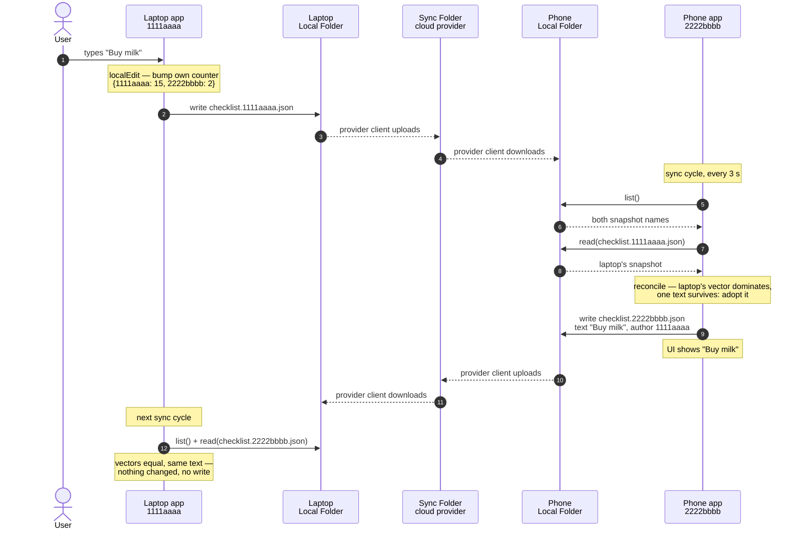

# Prototype

Prototype for syncing one single text field in a web application across multiple devices.

The goal of the prototype to solves these questions:

1. How does synchronisation between a Windows 11 laptop and an Android smartphone work?
2. How is a race condition handled?
3. What storage does it need on these devices?
4. Which browser can host the app?

The design contains **no**: database engine, API, OAuth, account, network code. The app reads and writes files in a
folder that resides in a cloud provider's directory. The provider's client has to be installed for multiple devices to
synchronise.

Which cloud provider is used makes no difference. The app needs three operations: `list`, `read`, `write`. Every
provider grants those by just being a folder.

## Answers

The four questions, answered. Each one is proven in the section it points at.

1. **Laptop and phone synchronise through a Sync Folder, never with each other.** Every device writes exactly one snapshot
   `checklist.<device-id>.json` and reads all of them. The cloud provider's client syncs the files between
   devices. → [§2 Application content synchronisation](#2-application-content-synchronisation)
2. **Race conditions are not prevented, they are detected.** Comparing version vectors derives whether race condition happens.
   One user with one edit will create new maximal set, all devices can fast-forward this version to solve the concurrent.
   → [§2.3 Race condition handle](#23-race-condition-handle), [§4 Race conditions](#4-race-conditions)
3. **The Sync Folder is the whole database.** Each device's copy is a full replica, so the app works offline by default. The
   only other storage is `localStorage`, holding the device id and label. No database engine, no IndexedDB. → [Storage](#storage)
4. Chrome, Edge and Firefox can host the app. → [Browser interaction](#browser-interaction)

## Setup

### Install

**Laptop - Bundle for Windows**

Creating and install the bundle

```bash
python3 install/make_windows_bundle.py
```

To also pass the Sync Folder while install

```bash
python3 install/make_windows_bundle.py --folder "C:\Dropbox\checklist"
```

**Laptop - running with CLI inside WSL**

Picking folder in UI

```bash
npm run proto
```

Folder as parameter

```bash
npm run proto -- --folder ~/Dropbox/checklist
```

**Android - APK**

All dependencies to build the APK are in Docker container: JDK, Android SDK, Gradle. The first run builds the image
(~2.4 GB), after that only the APK is rebuilt.

```bash
make proto_android
```

Gradle task pulls `public/`, `core/` and `adapters/` from `prototype/` at build time, so there is one copy of the sync
core and the phone cannot drift from the laptop.

### Running

The webapp will be located in `http://localhost:38531/`

Picking the folder in the page (if not specified during install): click **Choose folder…**.

On Android there is no localhost and no picker in the page: the app boots straight to **Choose folder…**, which opens
the _system_ picker (Storage Access Framework). The grant is kept across restarts, so the folder is picked once.

## Glossary

| Term           | Definition                                                                                                                                                                                                               |
| -------------- | ------------------------------------------------------------------------------------------------------------------------------------------------------------------------------------------------------------------------ |
| Sync Folder    | A specific shared folder in the cloud provider directory, which contains all items of the application.                                                                                                                   |
| Local Folder   | The folder on the device local storage. The cloud provider's client mirrors its content to the Sync Folder. The app's RW only to this folder.                                                                            |
| Windows bundle | An official embeddable Python staged on the Windows side plus a desktop shortcut to `pythonw.exe`. No `.exe` is produced deliberately, as a shortcut to Microsoft's own signed binary raises no SmartScreen warning.     |
| UI test mode   | `?uitest` in the URL or the button on the setup screen. The app uses in-memory folder with no disk and no network. `test/ui.mjs` uses this.                                                                |
| Device-id      | Eight hex characters, generated on a device's first run and kept in `localStorage` under `proto.deviceId`. Reset by "Clear site data" in DevTools.                                                                       |
| Snapshot       | `checklist.<device-id>.json` files inside the Sync Folder. Each file is a device's replica of the shared state; every device holds a full replica, which enables the app to work offline.                                |
| Maximal set    | Highest value of a version vector across all devices. Between `{1111aaaa: 17, 2222bbbb: 4}`, `{1111aaaa: 16, 2222bbbb: 5, 3333cccc: 1}` and `{1111aaaa: 17, 2222bbbb: 5, 3333cccc: 1}`, the last one is the maximal set. |

## Synchronisation Logic

There are two parts to synchronize:

1. Files and directories in Sync Folder.
2. Application Content: Values shown in the app's presentation layer for the end user.

### 1. File and folder in Sync Folder

Each device **writes only its own single Snapshot file** in the Sync Folder. As long as the device-id is unique, no two
devices write to the same file, so no race condition is possible for the items inside the Sync Folder.

The Sync Folder never tells a device that something happened. The files are quietly synchronized also when the app is
not running. Sync of content inside the folder will be handled by the cloud provider. The application has no logic for
this.

### 2. Application content synchronisation

#### 2.1. Snapshot

The Sync Folder has no locking or conditional write. Each device writes a distinct snapshot
`checklist.<device-id>.json`, that describes its state to the Sync Folder.

```
Sync Folder/
  checklist.1111aaaa.json     <- only the laptop ever writes this
  checklist.2222bbbb.json     <- only the phone ever writes this
```

Each device **writes one Snapshot** (its own) and reads every Snapshot in the Sync Folder. No concurrent write of a
Snapshot can happen.

Snapshot content

```json
{
  "device": "1111aaaa",
  "label": "laptop",
  "author": "1111aaaa",
  "text": "Buy milk",
  "sClock": { "1111aaaa": 3, "2222bbbb": 1 },
  "updatedAt": "2026-08-12T10:14:00Z"
}
```

| Field     | Description                                                                                                                                                                                                                                                                                                                                                                                                                   |
| --------- | ----------------------------------------------------------------------------------------------------------------------------------------------------------------------------------------------------------------------------------------------------------------------------------------------------------------------------------------------------------------------------------------------------------------------------- |
| device    | A generated 8-hex-character id that names the replica file and never changes.                                                                                                                                                                                                                                                                                                                                                 |
| label     | The human name for a device, display only, carried inside the file and never in its name.                                                                                                                                                                                                                                                                                                                                     |
| author    | The device that produced the current text, which is not always the device that owns the file. A device that adopts a peer's text keeps that peer as `author`.                                                                                                                                                                                                                                                                 |
| updatedAt | A timestamp for when the text was last authored. `author` and `updatedAt` are one pair. <br> It is stamped by the author's device, not by the device that owns the file. <br>It does not affect the sync process.                                                                                                                                                                                                             |
| text      | Value of the text field, specific for the prototype.                                                                                                                                                                                                                                                                                                                                                                          |
| sClock    | **Version vector**. It has 2 directions. <br> One counter records the version of its own device: `"1111aaaa": 3`.<br> The other counters are a receipt for what this device `1111aaaa` has read from another device `2222bbbb`: `"2222bbbb": 1`.<br>A device that has never appeared in the folder is simply absent from the vector and counts as `0`, so a third device joins with no registration step and no coordination. |

Change awareness is not received but derived. On every cycle a device reads the snapshots it finds and compares each
snapshot's `sClock` vector against its own.

**Only a device may increment its own counter.** Folding in a peer's edit joins the two vectors.

#### 2.2. Relation determination

Sync works by comparing two `sClock` against each other: `ours`, from this device's snapshot, and `peer`, from the
peer's snapshot.

`dominates(a, b)` answers whether every one of `a`'s counters is at least `b`'s. Calling it twice in different direction,
determines the relation between the two.

| `dominates(peer, ours)` | `dominates(ours, peer)` | Relation    | Consequence       |
| ----------------------- | ----------------------- | ----------- | ----------------- |
| true                    | false                   | peer ahead  | Adopt peer's text |
| false                   | true                    | peer behind | Nothing           |
| true                    | true                    | equal       | Nothing           |
| false                   | false                   | concurrent  | Race condition    |

#### 2.3. Race condition handle

When a race condition happens, any device aware of it can resolve it by writing the up-to-date application content. That
resolution carries an `sClock` that dominates every racing one, which makes it the new **maximal set**.

The app does not prevent races, it detects them afterwards. The detection is derived from the relation between the
version vectors of the snapshots in the folder.

#### 2.4. Maximal set

Every snapshot in the Sync Folder is handled at once. In each sync cycle a device does two steps:

1. **Drop every ancestor.** A snapshot that another snapshot strictly dominates has already been folded into that other
   one, so it carries nothing new. What survives is the maximal set.
2. **Look at the texts that are left.**

| Maximal set after step 1   | Consequence                                                                   |
| -------------------------- | ----------------------------------------------------------------------------- |
| one snapshot               | Adopt its text                                                                |
| several, all the same text | Adopt it; the sClock is the join of all of them                               |
| several, different texts   | Race condition between exactly those snapshots, raise conflict inside the app |

#### 2.5. The sync cycle

Every 3 s and on window focus, a full sync cycle starts:

- `list()` the folder,
- `read()` every file,
- `applyPeers()` the read files against its own snapshot (`core/device.mjs`, which reconciles in `core/merge.mjs`),
- write its own file back, but only if the merge changed something.

#### 2.6. Flowchart for normal sync between two devices

One edit on the laptop reaching the phone, with no race condition. Similar to the table in
[§2.7 Sync between two devices](#27-sync-between-two-devices)

There is no message exchange. The app only interacts with its Local Folder.



#### 2.7. Sync between two devices

`test/e2e/scenario.mjs` demonstrates every relation between two devices. The next table walks the same sequence, with the
same numbers the test asserts.

Each cell contains one device's partial snapshot: application content, vector, author and updatedAt.
**Bold** marks what changed for that device since the last event.
`1111aaaa`: device-id of the laptop
`2222bbbb`: device-id of the phone

| Event                               | Laptop                                                                                                                          | Phone                                                                                                                           | Relation       |
| ----------------------------------- | ------------------------------------------------------------------------------------------------------------------------------- | ------------------------------------------------------------------------------------------------------------------------------- | -------------- |
| Start state                         | `"Water the plants"`<br>`{1111aaaa: 14, 2222bbbb: 2}`<br>by `1111aaaa` at `10:00Z`                                              | `"Water the plants"`<br>`{1111aaaa: 14, 2222bbbb: 2}`<br>by `1111aaaa` at `10:00Z`                                              | equal          |
| Laptop writes a new text            | **`"Buy milk"`**<br><code>{1111aaaa: <b>15</b>, 2222bbbb: 2}</code><br>by `1111aaaa` at **`10:01Z`**                            | `"Water the plants"`<br>`{1111aaaa: 14, 2222bbbb: 2}`<br>by `1111aaaa` at `10:00Z`                                              | laptop ahead   |
| Phone syncs and adopts it           | `"Buy milk"`<br>`{1111aaaa: 15, 2222bbbb: 2}`<br>by `1111aaaa` at `10:01Z`                                                      | **`"Buy milk"`**<br><code>{1111aaaa: <b>15</b>, 2222bbbb: 2}</code><br>by `1111aaaa` at **`10:01Z`**                            | equal          |
| Phone adds `" and eggs"`            | `"Buy milk"`<br>`{1111aaaa: 15, 2222bbbb: 2}`<br>by `1111aaaa` at `10:01Z`                                                      | <code>"Buy milk <b>and eggs</b>"</code><br><code>{1111aaaa: 15, 2222bbbb: <b>3</b>}</code><br>by **`2222bbbb`** at **`10:02Z`** | phone ahead    |
| Laptop syncs and adopts it          | <code>"Buy milk <b>and eggs</b>"</code><br><code>{1111aaaa: 15, 2222bbbb: <b>3</b>}</code><br>by **`2222bbbb`** at **`10:02Z`** | `"Buy milk and eggs"`<br>`{1111aaaa: 15, 2222bbbb: 3}`<br>by `2222bbbb` at `10:02Z`                                             | equal          |
| Laptop goes offline and update text | **`"Buy milk, eggs and bread"`**<br><code>{1111aaaa: <b>16</b>, 2222bbbb: 3}</code><br>by **`1111aaaa`** at **`10:03Z`**        | `"Buy milk and eggs"`<br>`{1111aaaa: 15, 2222bbbb: 3}`<br>by `2222bbbb` at `10:02Z`                                             | laptop ahead   |
| Phone rewrites the line meanwhile   | `"Buy milk, eggs and bread"`<br>`{1111aaaa: 16, 2222bbbb: 3}`<br>by `1111aaaa` at `10:03Z`                                      | **`"Buy oat milk"`**<br><code>{1111aaaa: 15, 2222bbbb: <b>4</b>}</code><br>by `2222bbbb` at **`10:04Z`**                        | **concurrent** |

Any device can resolve the race condition; in this example it is the laptop.

In all 3 following cases the laptop writes the resolved text, which joins both racing vectors and then bumps its own
counter. The result is a new maximal set, and the phone can fast-forward to it. The maximal set is always `{17, 4}`
at the end in all cases, because the arithmetic is identical.

**A: the user keeps the laptop's text.**

| Event                          | Laptop                                                                                                                  | Phone                                                                                                                    | Relation     |
| ------------------------------ | ----------------------------------------------------------------------------------------------------------------------- | ------------------------------------------------------------------------------------------------------------------------ | ------------ |
| Laptop reconnects and resolves | `"Buy milk, eggs and bread"`<br><code>{1111aaaa: <b>17</b>, 2222bbbb: <b>4</b>}</code><br>by `1111aaaa` at **`10:05Z`** | `"Buy oat milk"`<br>`{1111aaaa: 15, 2222bbbb: 4}`<br>by `2222bbbb` at `10:04Z`                                           | laptop ahead |
| Phone syncs and fast-forwards  | `"Buy milk, eggs and bread"`<br>`{1111aaaa: 17, 2222bbbb: 4}`<br>by `1111aaaa` at `10:05Z`                              | **`"Buy milk, eggs and bread"`**<br><code>{1111aaaa: <b>17</b>, 2222bbbb: 4}</code><br>by **`1111aaaa`** at **`10:05Z`** | equal        |

**B: the user keeps the phone's text.**

| Event                          | Laptop                                                                                                          | Phone                                                                                                    | Relation     |
| ------------------------------ | --------------------------------------------------------------------------------------------------------------- | -------------------------------------------------------------------------------------------------------- | ------------ |
| Laptop reconnects and resolves | **`"Buy oat milk"`**<br><code>{1111aaaa: <b>17</b>, 2222bbbb: <b>4</b>}</code><br>by `1111aaaa` at **`10:05Z`** | `"Buy oat milk"`<br>`{1111aaaa: 15, 2222bbbb: 4}`<br>by `2222bbbb` at `10:04Z`                           | laptop ahead |
| Phone syncs and fast-forwards  | `"Buy oat milk"`<br>`{1111aaaa: 17, 2222bbbb: 4}`<br>by `1111aaaa` at `10:05Z`                                  | `"Buy oat milk"`<br><code>{1111aaaa: <b>17</b>, 2222bbbb: 4}</code><br>by **`1111aaaa`** at **`10:05Z`** | equal        |

**C: the user combines them by hand.** (The taken path in `test/e2e/scenario.mjs`)

| Event                          | Laptop                                                                                                                          | Phone                                                                                                                        | Relation     |
| ------------------------------ | ------------------------------------------------------------------------------------------------------------------------------- | ---------------------------------------------------------------------------------------------------------------------------- | ------------ |
| Laptop reconnects and resolves | **`"Buy oat milk, eggs and bread"`**<br><code>{1111aaaa: <b>17</b>, 2222bbbb: <b>4</b>}</code><br>by `1111aaaa` at **`10:05Z`** | `"Buy oat milk"`<br>`{1111aaaa: 15, 2222bbbb: 4}`<br>by `2222bbbb` at `10:04Z`                                               | laptop ahead |
| Phone syncs and fast-forwards  | `"Buy oat milk, eggs and bread"`<br>`{1111aaaa: 17, 2222bbbb: 4}`<br>by `1111aaaa` at `10:05Z`                                  | **`"Buy oat milk, eggs and bread"`**<br><code>{1111aaaa: <b>17</b>, 2222bbbb: 4}</code><br>by **`1111aaaa`** at **`10:05Z`** | equal        |

#### 2.8. Sync with more than 2 devices

There is **no**:

- difference in code path compared to the sync of 2 devices
- count of the total existing snapshots or devices
- leader, quorum, membership, vote

It is the same code, and any device may resolve a given conflict ([§4](#4-race-conditions)). If there are `n` amount of devices with `n` race conditions happening.
It stills means, that `1` edit will produces a dominating `sClock`, the new maximal set solves the race condition in all devices.

##### Sync when a third device joins

- 1111aaaa: device-id of a laptop
- 2222bbbb: device-id of a phone
- 3333cccc: device-id of a tablet

| State               | Laptop                                                                                                                                     | Phone                                                                                      | Tablet                                                                                                                                     | Relation         |
| ------------------- | ------------------------------------------------------------------------------------------------------------------------------------------ | ------------------------------------------------------------------------------------------ | ------------------------------------------------------------------------------------------------------------------------------------------ | ---------------- |
| Start state         | `"Buy milk, eggs and bread"`<br>`{1111aaaa: 17, 2222bbbb: 4}`<br>by `1111aaaa` at `10:05Z`                                                 | `"Buy milk, eggs and bread"`<br>`{1111aaaa: 17, 2222bbbb: 4}`<br>by `1111aaaa` at `10:05Z` | _no file yet_                                                                                                                              | all equal        |
| Tablet's first sync | `"Buy milk, eggs and bread"`<br>`{1111aaaa: 17, 2222bbbb: 4}`<br>by `1111aaaa` at `10:05Z`                                                 | `"Buy milk, eggs and bread"`<br>`{1111aaaa: 17, 2222bbbb: 4}`<br>by `1111aaaa` at `10:05Z` | **`"Buy milk, eggs and bread"`**<br>**`{1111aaaa: 17, 2222bbbb: 4}`**<br>by **`1111aaaa`** at **`10:05Z`**                                 | all equal        |
| Tablet adds `jam`   | `"Buy milk, eggs and bread"`<br>`{1111aaaa: 17, 2222bbbb: 4}`<br>by `1111aaaa` at `10:05Z`                                                 | `"Buy milk, eggs and bread"`<br>`{1111aaaa: 17, 2222bbbb: 4}`<br>by `1111aaaa` at `10:05Z` | **`"Buy milk, eggs, bread and jam"`**<br><code>{1111aaaa: 17, 2222bbbb: 4, <b>3333cccc: 1</b>}</code><br>by **`3333cccc`** at **`10:10Z`** | tablet ahead all |
| Laptop syncs        | **`"Buy milk, eggs, bread and jam"`**<br><code>{1111aaaa: 17, 2222bbbb: 4, <b>3333cccc: 1</b>}</code><br>by **`3333cccc`** at **`10:10Z`** | `"Buy milk, eggs and bread"`<br>`{1111aaaa: 17, 2222bbbb: 4}`<br>by `1111aaaa` at `10:05Z` | `"Buy milk, eggs, bread and jam"`<br>`{1111aaaa: 17, 2222bbbb: 4, 3333cccc: 1}`<br>by `3333cccc` at `10:10Z`                               | phone behind all |

##### Three devices, two racing

The phone has been offline since `10:05Z` and never saw the `jam` from the tablet.

| State                                                | Laptop                                                                                                                                             | Phone                                                                                                        | Tablet                                                                                                       | Relation                                                               |
| ---------------------------------------------------- | -------------------------------------------------------------------------------------------------------------------------------------------------- | ------------------------------------------------------------------------------------------------------------ | ------------------------------------------------------------------------------------------------------------ | ---------------------------------------------------------------------- |
| Phone rewrites the <br>line while offline            | `"Buy milk, eggs, bread and jam"`<br>`{1111aaaa: 17, 2222bbbb: 4, 3333cccc: 1}`<br>by `3333cccc` at `10:10Z`                                       | **`"Buy oat milk"`**<br><code>{1111aaaa: 17, 2222bbbb: <b>5</b>}</code><br>by **`2222bbbb`** at **`10:12Z`** | `"Buy milk, eggs, bread and jam"`<br>`{1111aaaa: 17, 2222bbbb: 4, 3333cccc: 1}`<br>by `3333cccc` at `10:10Z` | phone **concurrent** with both                                         |
| Laptop adds `coffee`                                 | **`"Buy milk, eggs, bread, jam and coffee"`**<br><code>{1111aaaa: <b>18</b>, 2222bbbb: 4, 3333cccc: 1}</code><br>by **`1111aaaa`** at **`10:13Z`** | `"Buy oat milk"`<br>`{1111aaaa: 17, 2222bbbb: 5}`<br>by `2222bbbb` at `10:12Z`                               | `"Buy milk, eggs, bread and jam"`<br>`{1111aaaa: 17, 2222bbbb: 4, 3333cccc: 1}`<br>by `3333cccc` at `10:10Z` | laptop ahead of tablet, **concurrent** with phone                      |
| All devices upload their <br>snapshot to Sync Folder | `"Buy milk, eggs, bread, jam and coffee"`<br>`{1111aaaa: 18, 2222bbbb: 4, 3333cccc: 1}`<br>by `1111aaaa` at `10:13Z`                               | `"Buy oat milk"`<br>`{1111aaaa: 17, 2222bbbb: 5}`<br>by `2222bbbb` at `10:12Z`                               | `"Buy milk, eggs, bread and jam"`<br>`{1111aaaa: 17, 2222bbbb: 4, 3333cccc: 1}`<br>by `3333cccc` at `10:10Z` | Race condition between Laptop and Phone. <br> Every device can see it. |

Three snapshots in Sync Folder and two of them race.

The same as a race between 2 devices: any of the three can settle it for all of them by writing a new maximal set.

The one difference: **only the texts of the devices actually in the race are offered.** The conflict set here is the
laptop and the phone. The tablet's vector `{17, 4, 1}` is dominated by the laptop's `{18, 4, 1}`, so the tablet is an
ancestor and its text is not part of the resolution.

Three devices can of course produce a three-sided race, and then all three texts are offered.

The resolution works exactly as in [§2.5](#25-sync-between-two-devices). Any device can pick one side, or write a combination of them all. The result dominates
every racing vector and becomes the new maximal set that the others fast-forward to.

Here the tablet resolves, keeping content from both the laptop and the phone.

| State                                  | Laptop                                                                                                                                                | Phone                                                                                                                                                 | Tablet                                                                                                                                                       | Relation         |
| -------------------------------------- | ----------------------------------------------------------------------------------------------------------------------------------------------------- | ----------------------------------------------------------------------------------------------------------------------------------------------------- | ------------------------------------------------------------------------------------------------------------------------------------------------------------ | ---------------- |
| Tablet resolves                        | `"Buy milk, eggs, bread, jam and coffee"`<br>`{1111aaaa: 18, 2222bbbb: 4, 3333cccc: 1}`<br>by `1111aaaa` at `10:13Z`                                  | `"Buy oat milk"`<br>`{1111aaaa: 17, 2222bbbb: 5}`<br>by `2222bbbb` at `10:12Z`                                                                        | **`"Buy oat milk, eggs, bread and jam"`**<br><code>{1111aaaa: <b>18</b>, 2222bbbb: <b>5</b>, 3333cccc: <b>2</b>}</code><br>by **`3333cccc`** at **`10:15Z`** | tablet ahead all |
| Laptop and phone sync and fast-forward | **`"Buy oat milk, eggs, bread and jam"`**<br><code>{1111aaaa: 18, 2222bbbb: <b>5</b>, 3333cccc: <b>2</b>}</code><br>by **`3333cccc`** at **`10:15Z`** | **`"Buy oat milk, eggs, bread and jam"`**<br><code>{1111aaaa: <b>18</b>, 2222bbbb: 5, 3333cccc: <b>2</b>}</code><br>by **`3333cccc`** at **`10:15Z`** | `"Buy oat milk, eggs, bread and jam"`<br>`{1111aaaa: 18, 2222bbbb: 5, 3333cccc: 2}`<br>by `3333cccc` at `10:15Z`                                             | all equal        |


### 4. Race conditions

1. **File and folder in Sync Folder.** There can be no race condition when writing a file into the Sync Folder, because
   a device only ever writes its own. A snapshot the cloud provider's client is still syncing fails to parse and is
   skipped until the next cycle.

2. **Application content.** Only one device needs to resolve a conflict, however many devices are racing, and no quorum
   is involved. The version vector only detects that a race condition has happened. There is no preventation method in
   the app by design.

When merge conflict, only content from concurrent devices are choosen. If the tablet's vector is `{17, 4, 1}` and
the laptop's vector is `{18, 4, 1}`, then tablet's text won't be a part of the merge resolution.

Resolving conflict create a maximal set, so every devices can fast-forward to.

A resolution is itself an edit, so two devices resolving the same conflict independently are just two more concurrent edits

## Build pipeline

One command builds both bundles:

```bash
make proto_all
```

Or step by step:

```bash
make proto_exe_win FOLDER='C:\Users\Nam\Dropbox\checklist'
make proto_android
make proto_clean
```

### Windows bundle

The Windows target downloads an official embeddable Python and stages it
on the Windows side. It needs **no** installer, pip, or admin rights.

No `.exe` is produced: a shortcut to Microsoft's own signed `pythonw.exe` raises no SmartScreen warning.
The prototype is not copied to the Windows side either. The bundle points at `serve.py` (over `\\wsl.localhost` under WSL).

### APK

The Android APK build process happens inside a Docker container.

## Storage

| What           | Where                                                   | Holds                                                                                                                                                        |
| -------------- | ------------------------------------------------------- | ------------------------------------------------------------------------------------------------------------------------------------------------------------ |
| Sync Folder    | Cloud provider                                          | The shared state. Every device's copy is a full replica, so local-first is automatic.                                                                        |
| Local Folder   | A folder, resides in local Android/Windows environment. | Full local replica of Sync Folder.                                                                                                                           |
| IndexedDB      | Browser                                                 | A pointer to the Local Folder that survive restart. The browser holds the right to use the folder. It's needed to not reprompting folder-picker every start. |
| `localStorage` | Browser                                                 | The device's identity: `deviceId` and `label`.                                                                                                               |

An offline edit is just a written file in Local Folder. The cloud client uploads it to Sync Folder when it can.
The application never communicate directly with Sync Folder.

## Browser interaction

This is the real constraint the prototype turned up, because Mozilla objected to the File System Access API.
Hence the two ways for setting the Sync Folder in Laptop.

| Browser in PC         | `showDirectoryPicker` | How it reaches the folder                    |
| --------------------- | --------------------- | -------------------------------------------- |
| Chrome / Edge desktop | Yes                   | Folder picker in browser or the local helper |
| **Firefox**           | **No**                | The local helper (`--folder`)                |

For the Anroid, the user needs to use folder picker after the first install or update.


## Development

### Where the code lives

```
prototype/
├── core/                       Sync process with no I/O, no clock, no window
│   ├── merge.mjs               Version vector
│   ├── device.mjs              Edit and resolve rules
│   └── folder-sync.mjs         Sync cycle
├── adapters/                   One per place a folder can come from, same three methods each
│   ├── node-folder.mjs         Real directory on disk
│   ├── fsaa-folder.mjs         Browser directory handle
│   ├── http-folder.mjs         Loopback helper
│   ├── android-folder.mjs      SAF grant, via WebView bridge
│   └── memory-folder.mjs       Used for UI test mode
├── install/
│   ├── serve.py                Stdlib-only loopback helper
│   ├── cli.mjs                 Same core driven from a terminal
│   └── make_windows_bundle.py  Bundle install for Windows
├── public/                     Web page; picks an adapter and hands it to core/
│   ├── index.html
│   ├── app.js
│   └── style.css
├── android/                    WebView shell and its Docker build; web assets copied in at build time
└── test/                       Plain node scripts, no test runner. Each run prints ok/FAIL and exits non-zero on failure
    ├── ui.mjs                  The page in Chromium: conflict UI, resolution, layout
    ├── android-bridge.mjs      The Android startup branch, Java bridge stubbed in-page
    └── e2e/                    Nothing stubbed in: real files, real processes, real browsers
        ├── scenario.mjs        The merge rules, two devices and a modelled cloud client, no browser
        └── bridge.mjs          The loopback helper path, driven with showDirectoryPicker deleted
```


**Folder adapter**: `core/folder-sync.mjs` receives an object with `list()`, `read(name)`, `write(name, content)` and
nothing else. Those three methods are its only route to a Local Folder.

### Test

Each file in `test/` asserts one part of the prototype's logic.
No test runner and nothing mocked in `core/`: what runs is the code that ships. A stand-in appears only where the real collaborator cannot run on this machine.

| Test                 | Run                     | What it test                                                                                                                                                                                                                                                                                                          |
| -------------------- | ----------------------- | ----------------------------------------------------------------------------------------------------------------------------------------------------------------------------------------------------------------------------------------------------------------------------------------------------------------------- |
| `e2e/scenario.mjs`   | `npm run proto:test`    | The merge rules between two devices.                                                                                 |
| `e2e/bridge.mjs`     | `npm run proto:bridge`  | The helper path works with Firefox, which has no `File System Access API`, and nothingdepends on said API. |
| `ui.mjs`             | `npm run proto:ui`      | One local edit writes exactly one file. <br> A peer that dominates is adopted silently. <br> A peer that raced raises the conflict panel <br> Resolving it dominates both sides.                                           |
| `android-bridge.mjs` | `npm run proto:android` | Behaviour of an Android app: startup, edits, conflict and resolution. It runs against an in-page stub.                   |

Test in `e2e/`
- self-contained tests for end-to-end with no stand-in at all
- test runs build their own temp folder on disk
- real processes, real browsers, and a modelled cloud client that only copies files.

`ui.mjs` and `android-bridge.mjs` test by using a page in Chromium. The helper has to be serving already
(`npm run proto`); `BASE` and `SHOTS` override the URL and where the screenshots land.


### Code Standards

#### Path Handling
- Use relative paths
- Never hardcode absolute paths or home directories
- Use `path.join()` for cross-platform compatibility

#### Naming Conventions
- Files: `kebab-case.js`, `PascalCase.js` (for classes)
- Functions/Variables: `camelCase`
- Constants: `UPPER_SNAKE_CASE`
- Components: `hyphenated-names`

#### Error Handling
- Use try/catch for async operations
- Provide helpful error messages
- Log errors with context
- Implement fallback mechanisms
